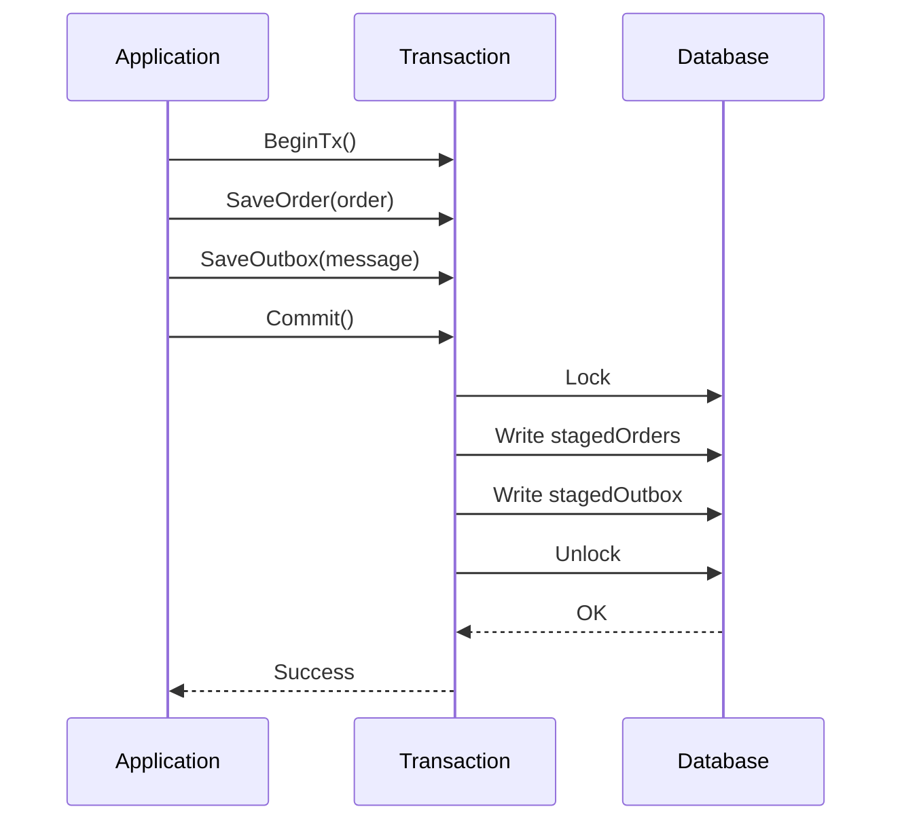
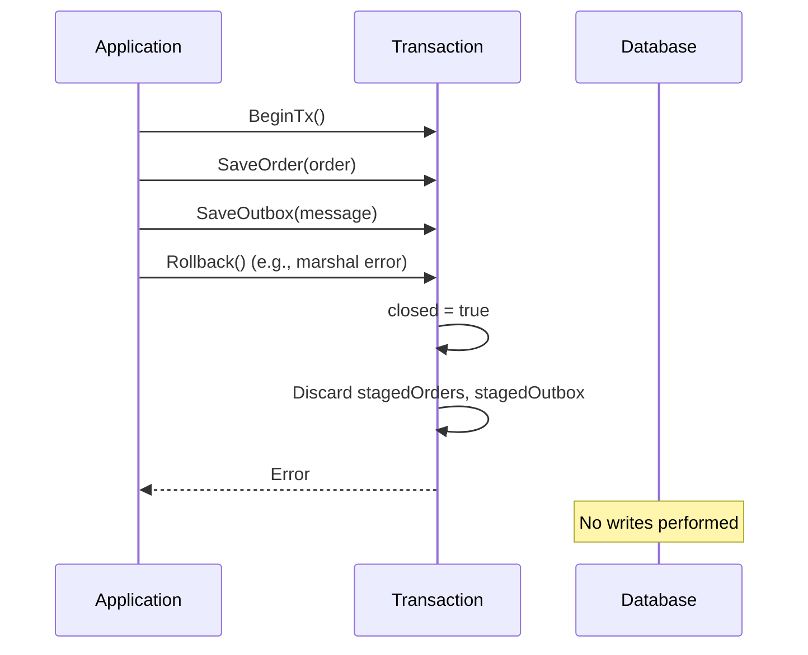
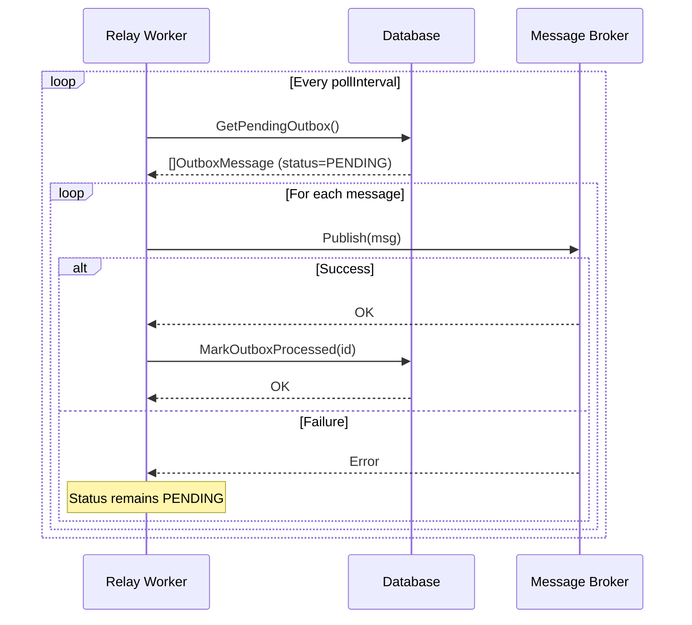
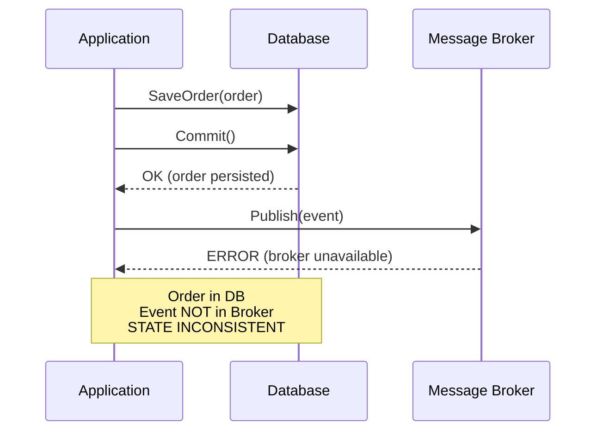
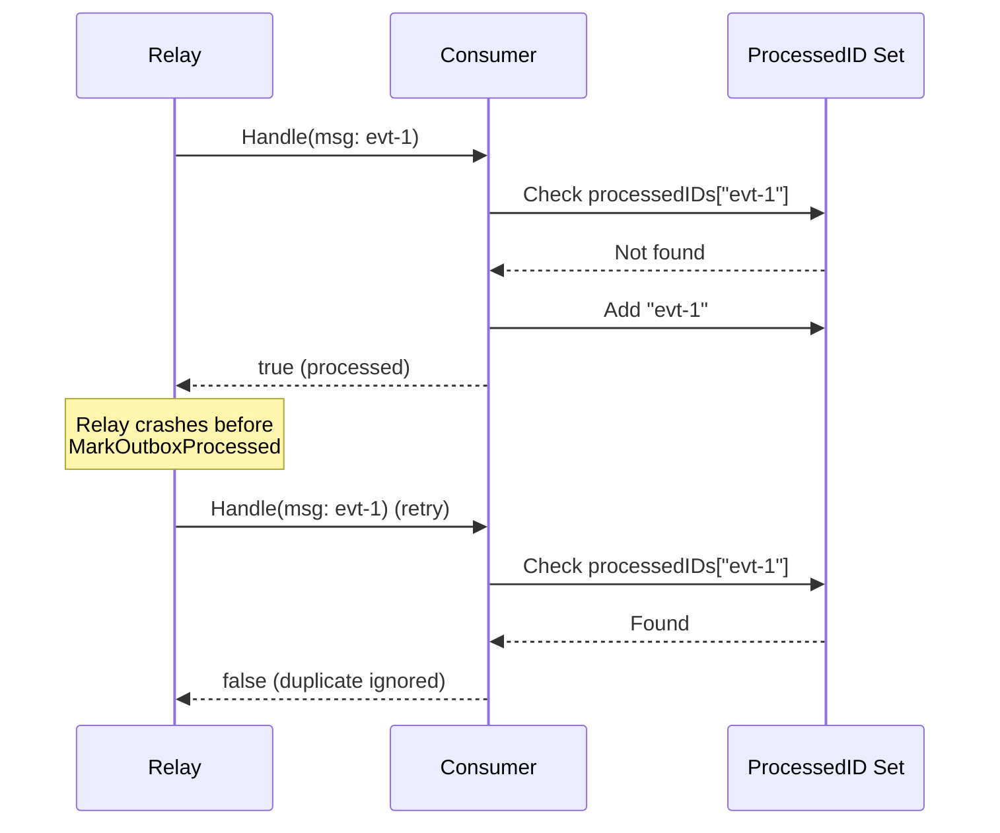
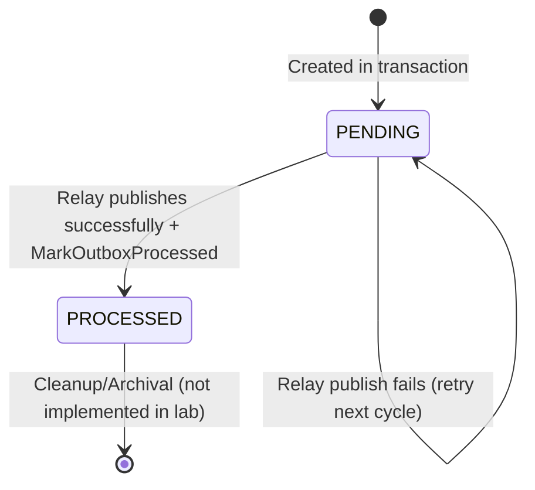

## Diagram 1 — Transactional Outbox Architecture

```mermaid
graph TB
    subgraph "Application Process"
        Service[OrderService]
        DB[(In-Memory DB)]
        Service -->|1. BeginTx| DB
        Service -->|2. SaveOrder| DB
        Service -->|3. SaveOutbox| DB
        Service -->|4. Commit| DB
    end

    subgraph "Asynchronous Relay"
        Relay[Relay Worker]
        DB -->|5. GetPendingOutbox| Relay
        Relay -->|6. Publish| Broker
        Broker[(Mock Broker)]
        Relay -->|7. MarkProcessed| DB
    end

    subgraph "Consumer"
        Consumer[Idempotent Consumer]
        Broker -->|8. Receive| Consumer
        Consumer -->|9. Deduplicate| Consumer
    end

    style Service fill:#e1f5fe
    style DB fill:#fff3e0
    style Relay fill:#f3e5f5
    style Broker fill:#e8f5e9
    style Consumer fill:#fce4ec
```

**Source**: Derived from `internal/outbox/service.go`, `internal/outbox/db.go`, `internal/outbox/relay.go`, `internal/outbox/broker.go`, `internal/outbox/consumer.go`.

## Diagram 2 — Transaction Flow (Atomic Write)



**Source**: `internal/outbox/db.go:99-116` (Commit), `internal/outbox/service.go:18-53` (CreateOrderWithOutbox).

## Diagram 3 — Rollback Flow



**Source**: `internal/outbox/db.go:118-127` (Rollback), `internal/outbox/service.go:28-32` (marshal error path).

## Diagram 4 — Relay Polling Cycle



**Source**: `internal/outbox/relay.go:43-59` (PollAndDispatch), `internal/outbox/relay.go:24-37` (Start).

## Diagram 5 — Dual-Write Failure Scenario



**Source**: `internal/outbox/service.go:55-90` (CreateOrderDualWriteNaive), `tests/outbox_test.go:117-139` (TestDualWriteProblem_Failure).

## Diagram 6 — Idempotent Consumer Handling Duplicates



**Source**: `internal/outbox/consumer.go:19-31` (Handle), `tests/outbox_test.go:92-115` (TestTransactionalOutbox_Idempotency_DuplicateDelivery).

## Diagram 7 — Outbox Message State Machine



**Source**: `internal/outbox/model.go:19-24` (MessageStatus), `internal/outbox/relay.go:43-59` (PollAndDispatch).

## Diagram 8 — Demo Scenarios Flow

```mermaid
flowchart TD
    Start([Demo Start]) --> S1[Scenario 1: Dual-Write]
    S1 --> BrokerFail[Broker.SetFailNext(true)]
    BrokerFail --> NaiveCall[CreateOrderDualWriteNaive]
    NaiveCall --> DBCommit[DB Commit Order]
    DBCommit --> BrokerError[Broker Publish FAILS]
    BrokerError --> Inconsistency[State: DB has order, Broker has 0 messages]
    
    Inconsistency --> S2[Scenario 2: Outbox Solution]
    S2 --> RelayStart[Relay.Start()]
    RelayStart --> AtomicCreate[CreateOrderWithOutbox]
    AtomicCreate --> AtomicCommit[Atomic Commit: Order + Outbox]
    AtomicCommit --> RelayPoll[Relay Polls Pending]
    RelayPoll --> BrokerPublish[Relay Publishes to Broker]
    BrokerPublish --> MarkProcessed[MarkOutboxProcessed]
    MarkProcessed --> ConsumerAccept[Consumer Accepts Message]
    
    ConsumerAccept --> S3[Scenario 3: Idempotency]
    S3 --> Duplicate[Send Duplicate Message]
    Duplicate --> ConsumerReject[Consumer Rejects Duplicate]
    ConsumerReject --> End([Demo Complete])
```

**Source**: `cmd/demo/main.go:21-62` (Demo execution), `engineering/03-execution-result.md:44-62` (Demo output).